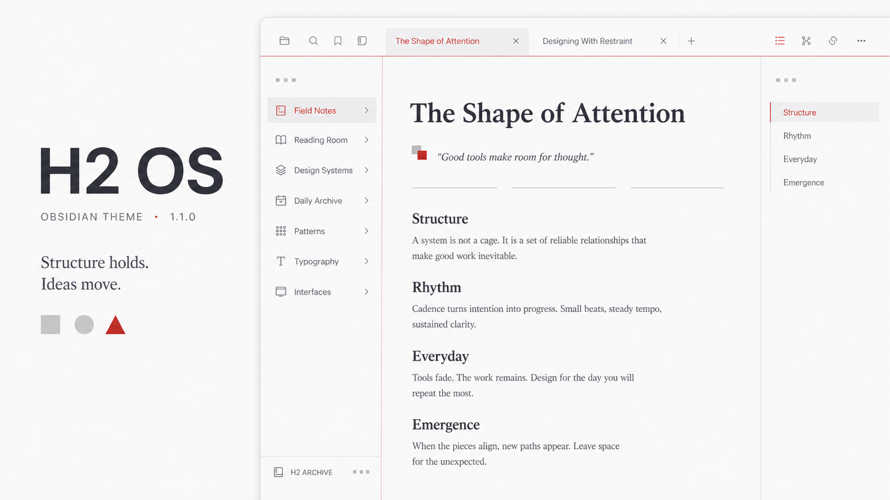
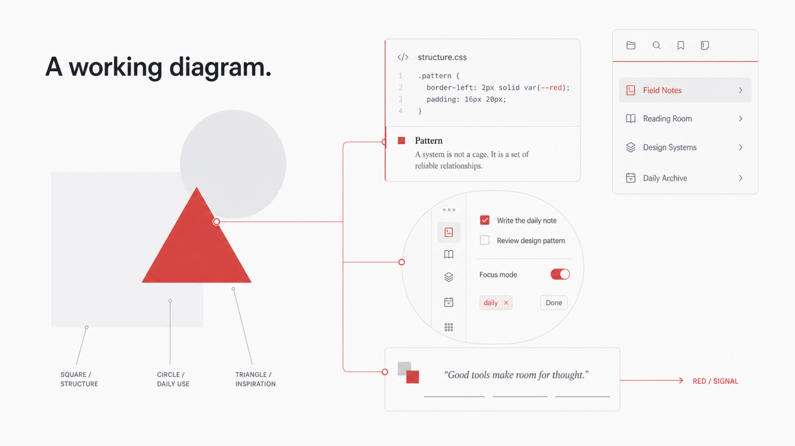

# H2 OS



> A geometric light theme for Obsidian. A white canvas, a restrained OnePlus red, and three shapes with real jobs. HydrogenOS stopped shipping years ago — its design discipline deserved better. H2 OS translates that discipline into a modern writing environment.

[中文介绍](https://github.com/elijahchan2019/obsidian-h2os-theme/blob/main/README.zh-CN.md) · Light mode · Desktop & mobile · No plugin required

---

## A story: the Hydrogen Mark



Open an empty tab and you meet the theme's mark — three shapes in a fixed relationship:

- **The square is structure.** Your notes, your vault, the surface that carries everything. Largest, and quietest.
- **The circle is daily use.** Every click, check, and page-through — where you touch the structure.
- **The triangle is inspiration.** The smallest shape, its tip rising from exactly where structure and daily use overlap.

Structure carries, days flow, ideas emerge. This is not an illustration. It is the working diagram of the entire theme.

## A discipline: red never decorates

In H2 OS, red is a signal, not a color. It appears at two kinds of moments:

- **"You are here"** — the red title of your active tab, the red dot beside the open file, the red caret you write with, the red point on a pinned tab.
- **"Something just happened"** — the ink that spreads through a checked task, the sweep across a search match, the underline redrawn under a hovered link.

Everything else stays white and gray. So every appearance of red is the interface speaking — one red element per screen, never more. Live with it a while and you start *reading* the red, the way you read punctuation.

## A redrawn layer: no mark left at default

H2 OS never touches a letterform, but it redraws every non-text mark on the page. Dividers are three-segment lines. Quotation marks are two interlocking squares. List bullets are square. The checkmark, the pin, the settings icon, twenty-two task-state markers — all regenerated from the same three atoms.

These are things you see hundreds of times a day without noticing. Replace them all, and the interface changes everywhere at once — even if you can't point to where.

## A canvas: order without borders

The window is one continuous white canvas; the tool areas on either side step back behind the faintest shift in temperature. No cards, no rows of dividers. All structural lines converge into **two red lines**:

- A horizontal line running under the navigation layer, edge to edge. When the app opens it sweeps left to right — gathering slowly, then snapping home past the midpoint.
- A vertical line standing at the settings sidebar, drawn top to bottom the moment Settings opens.

Every morning, the theme signs in with you.

## Motion with restraint

Discipline governs the constant; delight lives in events. The interface holds still until your action deserves a response: the ink-fill of a checked task, the two-beat entrance of the Hydrogen Mark, the sweep of a search match, the gentle rise of an unfolding list. `prefers-reduced-motion` is respected throughout; mobile keeps only direct interaction feedback.

## Recommended setup

- **Turn on inline titles** (Settings → Appearance → Show inline title): the display-scale opening of every note, and its unfolding three-segment line, live there.
- **Collapse the left ribbon**: the theme is built for minimalism, and the canvas is most complete without it — the frequent entry points all have hotkeys.
- Stay in light mode. The white canvas and gray-red depth system were tuned as one composition; switching to dark falls back to Obsidian's native appearance rather than a hasty inversion.

## Recommended fonts

No font files are bundled. Poppins or Montserrat gives Latin text its intended geometric character; Chinese text prefers Source Han Sans. On macOS:

```bash
brew install --cask font-poppins font-montserrat
```

Without them, H2 OS falls back to each platform's closest geometric face (Avenir Next on macOS, Segoe UI Variable on Windows), then the system sans-serif stack.

## Installation

From the Obsidian community theme browser:

1. Open **Settings → Appearance → Themes → Manage**
2. Search for **H2 OS**
3. Install and enable

Manual install: download `theme.css` and `manifest.json` from the latest release into:

```text
<vault>/.obsidian/themes/H2 OS/
```

## Compatibility

- Obsidian 1.5.0+
- Light mode · Desktop & mobile · Print & PDF · No plugin required
- H2 OS uses native CSS nesting. If parts of the theme do not appear, download the latest Obsidian installer to update the bundled Chromium runtime.

## License

[MIT](LICENSE)
